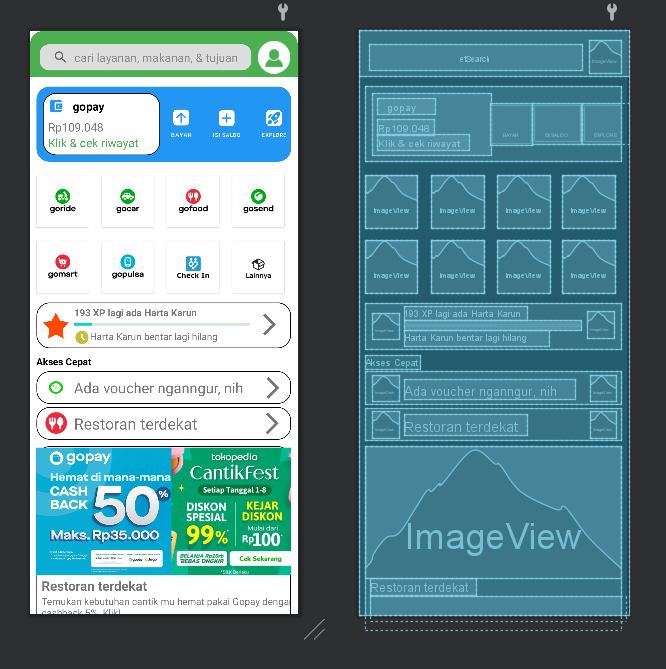
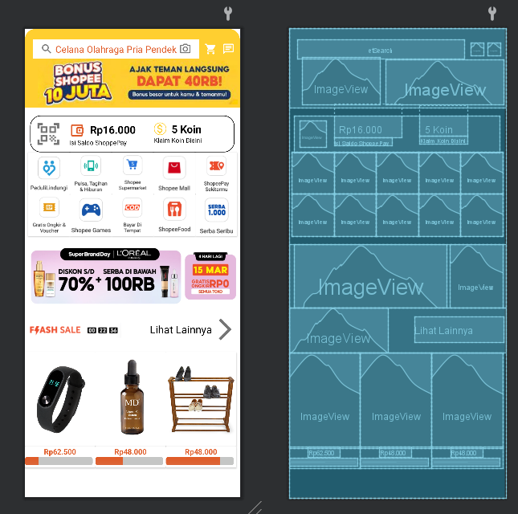

# Chapter2-Challenge2

## About
Version control, also known as source control, is the practice of tracking and managing changes to software code. 
Version control systems are software tools that help software teams manage changes to source code over time. 
As development environments have accelerated, version control systems help software teams work faster and smarter.

This application was originally created by Muhammad Mutawalli Sya'rawi For Complete Challenge Chapter 2 about version control and layout Binar Academy.

# Screenshot
## Here some screenshot of the program.

